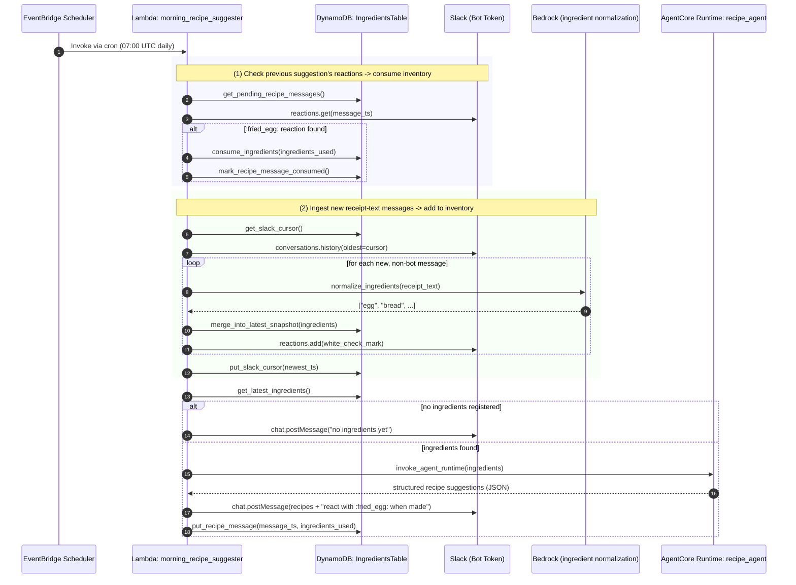
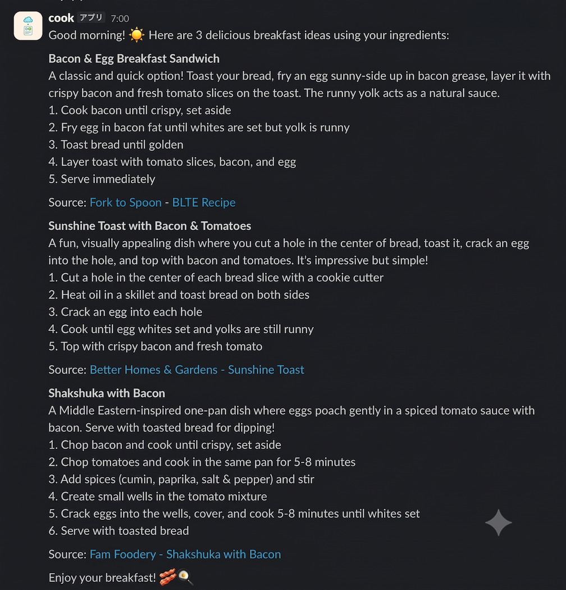

# Morning Recipe Agent (MorningChefAgent)

A schedule-driven, self-running agent that looks up the "latest popular recipes" every morning based on the ingredients you have on hand.

## What's New (v2)

The original Weekend Agent Challenge submission only supported manual ingredient entry (`scripts/seed_ingredients.py`) and a one-way Slack notification. This update adds two features:

1. **Automatic ingredient ingestion via Slack** — snap a photo of your grocery receipt, extract the text with your phone's built-in OCR (no app needed), and paste it into a Slack channel. The agent picks it up on its next scheduled run.
2. **Inventory consumption tracking** — react with `:fried_egg:` 🍳 to a morning suggestion you actually cooked, and the ingredients it used are automatically removed from your inventory the next time the agent runs.

Both features are **pull-based**: the agent reads Slack (new messages, reactions) each time it wakes up on its schedule, rather than listening for events in real time. This keeps the architecture simple — no API Gateway, no webhook signature verification, no always-on listener. See [Design Decisions](#design-decisions) below for why.

## Architecture

### Processing Flow



### Example Slack Notification



- The schedule is defined in UTC by default (`SCHEDULE_CRON`, `SCHEDULE_TIMEZONE` — see Environment Variables below); the currently deployed instance runs at 07:00 UTC (16:00 JST).
- Web search uses [Amazon Bedrock AgentCore Web Search Tool](https://docs.aws.amazon.com/bedrock-agentcore/latest/devguide/gateway-target-connector-web-search-tool.html), which needs no third-party API key (currently `us-east-1` only).
- Connecting to the Gateway (IAM/SigV4 authentication) uses the AWS official library [`mcp-proxy-for-aws`](https://github.com/aws/mcp-proxy-for-aws).
- `recipe_agent` returns structured JSON (via Strands `structured_output_model`) rather than free-form mrkdwn text; the Lambda assembles the final Slack message from that structured data.

### How to add ingredients

This is designed around your phone's camera, not a dedicated scanning app:

1. Take a photo of your grocery receipt (or open an existing photo of one).
2. Use your phone's built-in text recognition to select and copy the receipt text — e.g. on iPhone, enable "Live Text" (Settings > General > Language & Region > Text Recognition, then Settings > Camera > Show Detected Text), then long-press the text in a photo to select and copy it.
3. Paste the copied text as a plain message into the Slack channel configured for this agent.
4. On its next scheduled run, the agent reads the message, asks Bedrock to extract and normalize the ingredient names (ignoring store name, prices, tax/subtotal lines, loyalty points, etc.), and merges them into your inventory. It reacts with ✅ once a message has been processed, so you can see at a glance what's been picked up.

**Future idea**: if your grocery store issues electronic/digital receipts (email or app-based), those could be ingested directly — e.g. via an email forwarding rule or the store's own API — instead of relying on the phone-camera + OCR step. This would remove the manual photo step entirely for stores that support it. Not implemented yet.

### Why not Amazon Textract?

Textract's `AnalyzeExpense` API was the first choice considered for receipt parsing, but Textract currently supports English, Spanish, Italian, Portuguese, French, and German only — Japanese receipts are not supported at all (vertical text isn't supported either). Since this project is built around Japanese supermarket receipts, the phone-camera + Slack approach above was used instead: it needs no AWS-side OCR service, works with whatever language your phone's OCR supports, and requires no new AWS infrastructure.

### Design Decisions

- **Pull over push for Slack integration**: reading Slack messages/reactions on each scheduled run, instead of using Slack's Events API / Interactive Components, avoids needing API Gateway, request signature verification, and an always-on webhook receiver. The trade-off is that reactions/messages are only picked up the next time the schedule fires (not instantly) — acceptable for a once-a-day agent.
- **Bot Token over Incoming Webhook**: reading messages and reactions requires the Slack Web API (`conversations.history`, `reactions.get`), which needs a Bot Token; a plain Incoming Webhook can only post and doesn't return a message timestamp, so it can't be used for consumption tracking.
- **Orchestration in Lambda, not in the agent**: the multi-step flow above (check reactions, ingest messages, merge/consume ingredients, generate recipes, post, record) is implemented as deterministic Lambda code rather than as additional tools exposed to `recipe_agent` via AgentCore Gateway. Sequencing, idempotency (the Slack cursor), and set operations (union/difference on ingredient names) are simpler and more reliable as code than as LLM-driven tool calls; `recipe_agent` is kept focused on the one task that actually benefits from reasoning — searching for and selecting recipes.

## AWS Services Used

Amazon DynamoDB / AWS Lambda / Amazon Bedrock (Claude Haiku 4.5) / Amazon Bedrock AgentCore Runtime / Amazon Bedrock AgentCore Gateway (Web Search Tool) / Amazon EventBridge Scheduler / AWS Systems Manager Parameter Store / AWS IAM / AWS CDK (Python)

## Directory Structure

```
cdk/                        CDK stack (DynamoDB, Lambda, EventBridge Scheduler)
lambda/morning_recipe_suggester/
  handler.py                 Orchestration: reaction check -> message ingest -> recipe generation -> post
  dynamo_store.py             DynamoDB access layer (snapshot / Slack cursor / recipe message records)
  slack_client.py             Slack Web API client (chat.postMessage, conversations.history, reactions.*)
  ingredient_normalizer.py     Bedrock Converse call that normalizes receipt text into ingredient names
  agentcore_client.py          Invokes recipe_agent and parses its structured JSON response
agentcore/recipe_agent/      AgentCore Runtime (recipe_agent) and Gateway setup scripts
scripts/                    Ingredient seeding / smoke-test scripts
```

## Setup

All environment-specific parameters (account ID, region, ARNs, etc.) are supplied via environment variables. There are no hardcoded values.

### 0. Prerequisites

```bash
aws sso login --profile <your-profile>
export AWS_PROFILE=<your-profile>
export AWS_REGION=us-east-1   # Web Search Tool is us-east-1 only
```

### 1. Set up the AgentCore Gateway (Web Search Tool)

```bash
cd agentcore/recipe_agent
pip install -r requirements.txt
python3 setup_gateway.py
# Note the GATEWAY_MCP_ENDPOINT and Gateway ARN printed in the output
```

### 2. Deploy recipe_agent (AgentCore Runtime)

```bash
agentcore configure --entrypoint recipe_agent.py --name recipe_agent \
  --requirements-file requirements.txt --region "$AWS_REGION" --non-interactive
agentcore launch \
  --env GATEWAY_MCP_ENDPOINT=<output from setup_gateway.py> \
  --env AWS_REGION="$AWS_REGION" \
  --env MODEL_ID=us.anthropic.claude-haiku-4-5-20251001-v1:0

# Grant the execution role permission to invoke the Gateway
export EXECUTION_ROLE_NAME=<check aws.execution_role in .bedrock_agentcore.yaml>
export GATEWAY_ARN=<Gateway ARN noted in step 1>
python3 grant_gateway_access.py
```

### 3. Create a Slack App and Bot Token

1. Create (or reuse) a Slack App at https://api.slack.com/apps.
2. Under **OAuth & Permissions**, add these Bot Token Scopes:
   - `chat:write`
   - `channels:history` (if the channel is public) or `groups:history` (if it's private) — match whichever type you use
   - `reactions:read`
   - `reactions:write`
3. Click **Install to Workspace** (or **Reinstall to Workspace** if scopes changed), then copy the **Bot User OAuth Token** (`xoxb-...`).
4. Create a channel for this agent (e.g. `#morning-chef`) and invite the bot: `/invite @<bot name>`.
5. Note the channel ID (open the channel details / "View channel details" and copy the ID shown at the bottom).

### 4. Deploy the CDK stack

```bash
cd ../../cdk
python3 -m venv .venv && source .venv/bin/activate
pip install -r requirements.txt

export DEPLOY_REGION="$AWS_REGION"
export RECIPE_AGENT_RUNTIME_ARN=<Agent ARN output from agentcore launch>
export SLACK_CHANNEL_ID=<channel ID noted in step 3>
# Optional: SLACK_BOT_TOKEN_PARAM_NAME, INGREDIENT_MODEL_ID, SCHEDULE_CRON, SCHEDULE_TIMEZONE

cdk deploy
```

### 5. Register the Slack bot token

```bash
aws ssm put-parameter \
  --name "/morning-agent/slack-bot-token" \
  --type SecureString \
  --value "<Bot User OAuth Token (xoxb-...)>" \
  --region "$AWS_REGION"
```

### 6. Seed ingredients and smoke-test

```bash
export TABLE_NAME=<DynamoDB table name output from cdk deploy>
python3 scripts/seed_ingredients.py egg bread bacon tomato

aws lambda invoke --function-name <Lambda function name> --payload '{}' \
  --cli-binary-format raw-in-base64-out /tmp/out.json --region "$AWS_REGION"
```

## Environment Variables

| Variable | Used in | Required | Description |
|---|---|---|---|
| `AWS_REGION` | overall | Required (agent/scripts) | Deployment/runtime region |
| `DEPLOY_REGION` | cdk/app.py | Optional (defaults to us-east-1) | CDK deployment region |
| `RECIPE_AGENT_RUNTIME_ARN` | cdk/app.py | Required | recipe_agent's AgentCore Runtime ARN |
| `SLACK_BOT_TOKEN_PARAM_NAME` | cdk/app.py, Lambda | Optional (defaults to `/morning-agent/slack-bot-token`) | SSM parameter name for the Slack bot token |
| `SLACK_CHANNEL_ID` | cdk/app.py, Lambda | Required | Slack channel ID the agent reads from and posts to |
| `INGREDIENT_MODEL_ID` | cdk/app.py, Lambda | Optional (defaults to Claude Haiku 4.5) | Bedrock model used to normalize receipt text into ingredient names |
| `CONSUMPTION_WINDOW_DAYS` | Lambda | Optional (defaults to 4) | Days a posted suggestion stays eligible for `:fried_egg:` consumption tracking before its record expires |
| `SCHEDULE_CRON` | cdk/app.py | Optional (defaults to `cron(0 7 * * ? *)`, i.e. 07:00 UTC / 16:00 JST) | EventBridge Scheduler cron expression |
| `SCHEDULE_TIMEZONE` | cdk/app.py | Optional (defaults to `UTC`) | Scheduler timezone |
| `GATEWAY_MCP_ENDPOINT` | recipe_agent.py | Required | AgentCore Gateway's MCP endpoint URL |
| `MODEL_ID` | recipe_agent.py | Optional | Bedrock model ID for recipe_agent |
| `TABLE_NAME` | scripts/seed_ingredients.py | Required | DynamoDB table name |
