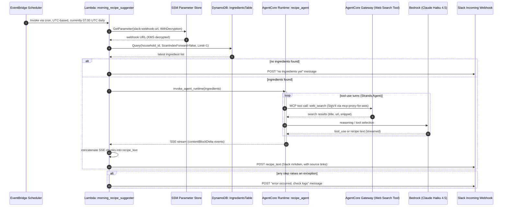

# Morning Recipe Agent (MorningChefAgent)

A schedule-driven, self-running agent that looks up the "latest popular recipes" every morning based on the ingredients you have on hand.
Submission for the [AWS Builder Center Weekend Agent Challenge](https://builder.aws.com/).

## Architecture

### Processing Flow



- The schedule is defined in UTC by default (`SCHEDULE_CRON`, `SCHEDULE_TIMEZONE` — see Environment Variables below); the currently deployed instance runs at 07:00 UTC (16:00 JST).
- Ingesting the ingredient list (e.g. receipt photo parsing) is not implemented yet. Ingredients are seeded manually via `scripts/seed_ingredients.py`. Because the input and output flows are decoupled through DynamoDB, adding a receipt-photo pipeline (Bedrock Vision) in the future would require no changes to this output flow.
- Web search uses [Amazon Bedrock AgentCore Web Search Tool](https://docs.aws.amazon.com/bedrock-agentcore/latest/devguide/gateway-target-connector-web-search-tool.html), which needs no third-party API key (currently `us-east-1` only).
- Connecting to the Gateway (IAM/SigV4 authentication) uses the AWS official library [`mcp-proxy-for-aws`](https://github.com/aws/mcp-proxy-for-aws).
- Slack notifications are generated in English using Slack's `mrkdwn` syntax (bold `*text*`, links `<url|text>`) per the system prompt — not Markdown's `**bold**` or `[text](url)`.

## AWS Services Used

Amazon DynamoDB / AWS Lambda / Amazon Bedrock (Claude Haiku 4.5) / Amazon Bedrock AgentCore Runtime / Amazon Bedrock AgentCore Gateway (Web Search Tool) / Amazon EventBridge Scheduler / AWS Systems Manager Parameter Store / AWS IAM / AWS CDK (Python)

## Directory Structure

```
cdk/                        CDK stack (DynamoDB, Lambda, EventBridge Scheduler)
lambda/morning_recipe_suggester/  Lambda function body
agentcore/recipe_agent/     AgentCore Runtime (recipe_agent) and Gateway setup scripts
scripts/                    Ingredient seeding / smoke-test scripts
```

## Setup

All environment-specific parameters (account ID, region, ARNs, etc.) are supplied via environment variables. There are no hardcoded values.

### 0. Prerequisites

```bash
aws sso login --profile <your-profile>
export AWS_PROFILE=<your-profile>
export AWS_REGION=us-east-1   # Web Search Tool is us-east-1 only
```

### 1. Set up the AgentCore Gateway (Web Search Tool)

```bash
cd agentcore/recipe_agent
pip install -r requirements.txt
python3 setup_gateway.py
# Note the GATEWAY_MCP_ENDPOINT and Gateway ARN printed in the output
```

### 2. Deploy recipe_agent (AgentCore Runtime)

```bash
agentcore configure --entrypoint recipe_agent.py --name recipe_agent \
  --requirements-file requirements.txt --region "$AWS_REGION" --non-interactive
agentcore launch \
  --env GATEWAY_MCP_ENDPOINT=<output from setup_gateway.py> \
  --env AWS_REGION="$AWS_REGION" \
  --env MODEL_ID=us.anthropic.claude-haiku-4-5-20251001-v1:0

# Grant the execution role permission to invoke the Gateway
export EXECUTION_ROLE_NAME=<check aws.execution_role in .bedrock_agentcore.yaml>
export GATEWAY_ARN=<Gateway ARN noted in step 1>
python3 grant_gateway_access.py
```

### 3. Deploy the CDK stack

```bash
cd ../../cdk
python3 -m venv .venv && source .venv/bin/activate
pip install -r requirements.txt

export DEPLOY_REGION="$AWS_REGION"
export RECIPE_AGENT_RUNTIME_ARN=<Agent ARN output from agentcore launch>
# Optional: SLACK_WEBHOOK_PARAM_NAME, SCHEDULE_CRON, SCHEDULE_TIMEZONE

cdk deploy
```

### 4. Register the Slack webhook URL

```bash
aws ssm put-parameter \
  --name "/morning-agent/slack-webhook-url" \
  --type SecureString \
  --value "<Slack Incoming Webhook URL>" \
  --region "$AWS_REGION"
```

### 5. Seed ingredients and smoke-test

```bash
export TABLE_NAME=<DynamoDB table name output from cdk deploy>
python3 scripts/seed_ingredients.py egg bread bacon tomato

aws lambda invoke --function-name <Lambda function name> --payload '{}' \
  --cli-binary-format raw-in-base64-out /tmp/out.json --region "$AWS_REGION"
```

## Environment Variables

| Variable | Used in | Required | Description |
|---|---|---|---|
| `AWS_REGION` | overall | Required (agent/scripts) | Deployment/runtime region |
| `DEPLOY_REGION` | cdk/app.py | Optional (defaults to us-east-1) | CDK deployment region |
| `RECIPE_AGENT_RUNTIME_ARN` | cdk/app.py | Required | recipe_agent's AgentCore Runtime ARN |
| `SLACK_WEBHOOK_PARAM_NAME` | cdk/app.py, Lambda | Optional | SSM parameter name for the Slack webhook |
| `SCHEDULE_CRON` | cdk/app.py | Optional (defaults to `cron(0 7 * * ? *)`, i.e. 07:00 UTC / 16:00 JST) | EventBridge Scheduler cron expression |
| `SCHEDULE_TIMEZONE` | cdk/app.py | Optional (defaults to `UTC`) | Scheduler timezone |
| `GATEWAY_MCP_ENDPOINT` | recipe_agent.py | Required | AgentCore Gateway's MCP endpoint URL |
| `MODEL_ID` | recipe_agent.py | Optional | Bedrock model ID |
| `TABLE_NAME` | scripts/seed_ingredients.py | Required | DynamoDB table name |
